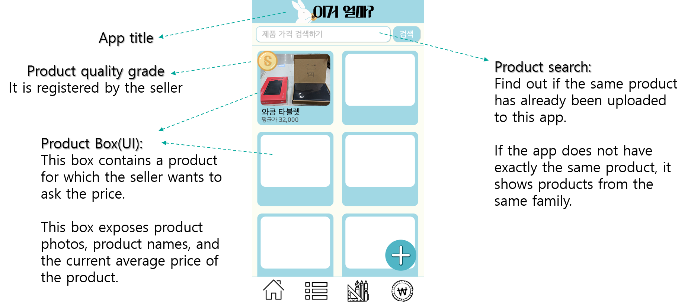
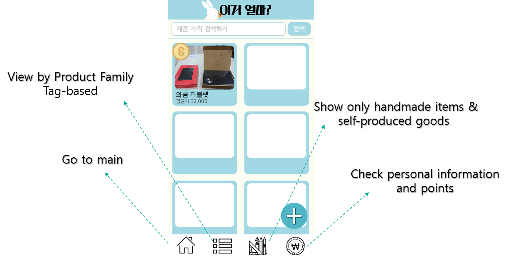
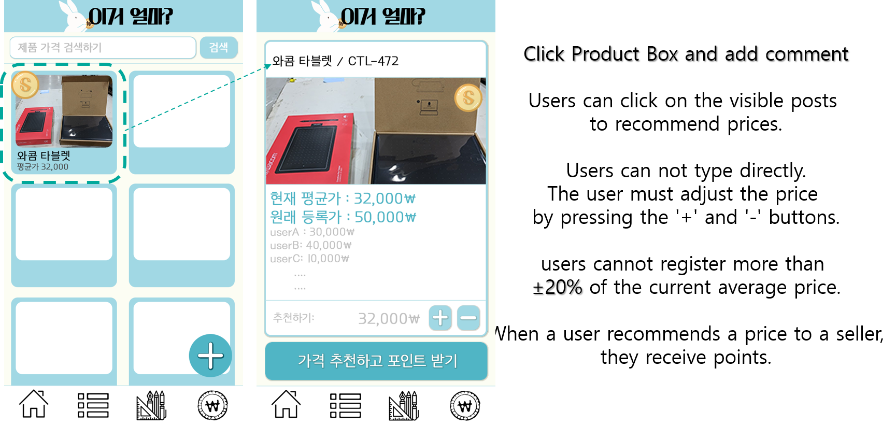
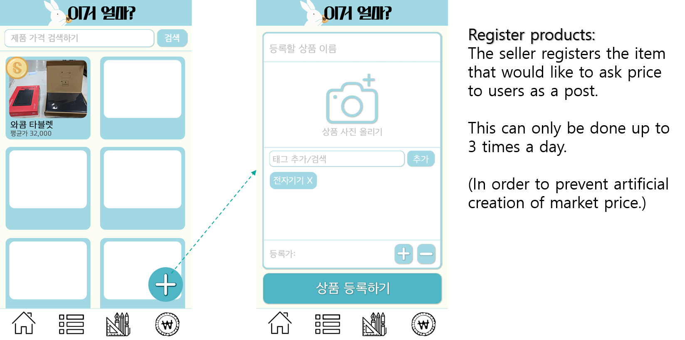

# Price_This
Android app project

Usually, people do not know how much the price of this used goods.
It costs a lot of time to figure out the price.

It's hard to decide the value of product by Artist doing 'one man business'.

For these people, here's solution.

This app will be helpful for above two cases.
User can post question about the proper price of certain product and users will answer about it only with "Price", no comments.

# UI concept
**Main** 

**Bottom Menu**

**Box** 

**Ask Question**

